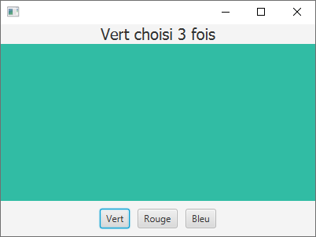

# TD/TP 1 -- Introduction à JavaFX [1]
 [1] Adapté du [support de TP](https://gitlabinfo.iutmontp.univ-montp2.fr/ihm/tp1) de [Sophie Nabitz](mailto:sophie.nabitz@univ-avignon.fr),
      [Cyrille Nadal](mailto:cyrille.nadal@umontpellier.fr),
      [Nathalie Palleja](mailto:nathalie.palleja@umontpellier.fr),
      [Xavier Palleja](mailto:xavier.palleja@umontpellier.fr),
      [Petru Valicov](mailto:petru.valicov@umontpellier.fr) (IUT de Montpellier-Sète, département informatique).


## Partie 0 : Introduction à l'environnement de développement

Dans ces TD, nous allons utiliser IntelliJ IDEA (sous "Linux pour tous"). Nous utiliserons aussi [Maven](https://fr.wikipedia.org/wiki/Apache_Maven) comme système de build pour les projets JavaFX (il est intégré à IntelliJ IDEA). 

Dans un premier temps, nous allons implémenter une application basique "Hello World" avec IntelliJ et JavaFX. Pour cela, vous suivrez le tutoriel prévu à cet effet dans la documentation de IntelliJ. La procédure peut varier sensiblement en fonction de la version de IntelliJ. Pour la dernière version, vous pouvez vous référer à [cette page](https://www.jetbrains.com/help/idea/2022.2/javafx.html#run). Pour la version installée sur les machines de l'IUT (version 2022.2 sous Linux), vous devez vous référez à [cette page](https://www.jetbrains.com/help/idea/2022.2/javafx.html#run).

A la fin du tutoriel, nous obtenons le projet et l'application suivante:


Ainsi le répertoire **src/main/java** contiendra :
* L'ensemble des paquetages de votre application ; dans l'exemple de l'image ci-dessus, il n'y en a qu'un -- `com.example.javafxdemo`.
* Un fichier spécial `module-info.java` qui décrit l'ensemble des paquetages externes utilisés dans votre application. En l'occurrence, les paquetages de la librairie JavaFX (on vous rappelle que JavaFX ne fait pas partie de l'API native Java). Les modules constituent une fonctionnalité importante de Java depuis la version 9 de la plateforme. Ils permettent de construire des exécutables légers (_.jar_) en y encapsulant l'ensemble de dépendances nécessaires au bon fonctionnement. En quelque sorte, on peut les voir comme une généralisation de la notion de paquetage. Pour plus de détails :
    * https://en.wikipedia.org/wiki/Java_Platform_Module_System
    * https://en.wikipedia.org/wiki/Modular_programming
    * https://www.baeldung.com/java-9-modularity
    * https://www.oracle.com/fr/corporate/features/understanding-java-9-modules.html

Le répertoire **src/main/resources** contiendra l'ensemble de ressources du projet : images, feuilles de styles CSS, les fichiers `.fxml` contenant la description déclarative de vos interfaces graphiques, etc.

Le répertoire **src/main/test** contiendra l'intégralité des tests de votre application. Notez que pour le moment, vous n'allez pas écrire des tests unitaires pour tester vos IHM, donc le répertoire **src/main/test** n'apparaîtra pas pour le moment dans vos projets. Au moment où vous voudrez ajouter des tests unitaires, vous aurez éventuellement à créer ce répertoire.

Nous allons maintenant relier ce projet IntelliJ avec notre compte GitHub afin de pouvoir le versionner. Pour cela, il faut aller dans le menu principal d'IntelliJ, sélectionner ``VCS``, puis cliquer sur ``Share Project on GitHub``.


Dans la fenêtre qui s'ouvre, vous devez ensuite sélectionner `Add account`` pour relier votre compte GitHub. 


Une fenêtre du navigateur s'ouvre alors sur le site GitHub. Il faut saisir les informations sur son compte et valider. Un code de connexion est alors envoyé à votre boîte mail. Vous devez le copier dans l'espace prévu dans la fenêtre du navigateur. Un message vous demande d'autoriser l'IDE de JetBrains à se connecter au compte GithHub. Un fois que cela est fait, IntelliJ est relié à votre compte GitHub et vous pouvez partager votre projet (bouton ``Share``). 

Il suffit ensuite de faire votre première indexation des fichiers à ajouter au dépôt ("stage"), et votre premier commit, en cliquant sur ``Add``.


A partir de cet instant, un nouveau menu "Git" est ajouté à IntelliJ dans le bandeau au dessus du code. Il permet de faire les principales opérations sur les dépôts Git (*update*, *commit* et *push*).


 Il est aussi possible d'utiliser la fenêtre de gestion Git (située en dessous du code) pour avoir plus d'options. Pour la rendre visible, il suffit de cliquer sur l'onglet ``Git`` tout en bas de la fenêtre.


Tout au long des TD/TP, vous aurez besoin de **consulter [les pages de documentation de JavaFX](https://openjfx.io/javadoc/18/)**. 


#### Consignes pour une installation sur votre machine personnelle :

Notez que depuis 2018 JavaFX ne fait pas partie de l'API Java officielle, le développement étant externalisé dans la communauté [OpenJDK](https://openjdk.java.net/) dans le projet [OpenJFX](https://wiki.openjdk.java.net/display/OpenJFX/Main).

La librairie JavaFX n'est donc pas automatiquement installée avec la plateforme Java. Pour installer JavaFX sur votre machine, on vous recommande de télécharger le SDK complet : https://gluonhq.com/products/javafx/. Sur Linux, il suffit d'extraire l'archive contenant la SDK dans votre répertoire d'installation, par exemple dans `/opt`. Lors de la première utilisation de JavaFX avec votre IDE, vous devriez indiquer le chemin d'accès à la SDK JavaFX sur votre machine.

Si vous utilisez IntelliJ IDEA, JavaFX est installé par défaut.


## Partie 1 : Contrôleurs et mise en page


### 1.1 - Premiers pas avec JavaFX : 

Rappelez-vous que JavaFX est un framework Java pour le développement des interfaces graphiques (GUI, ou *Graphical User Interface*) en Java. Une GUI JavaFX est construite grâce à un **graphe de scène**, où les **nœuds** correspondent à un ensemble d'éléments graphiques organisés de manière hiérarchique. La scène (un objet de type [`Scene`](https://openjfx.io/javadoc/18/javafx.graphics/javafx/scene/Scene.html)) est associée à une fenêtre qui correspond à un objet de type [`Stage`](https://openjfx.io/javadoc/18/javafx.graphics/javafx/stage/Stage.html).

Dans l'exemple précédent, nous avons créé une application JavaFX basique (`HelloApplication`) avec une fenêtre unique. En principe, une application peut avoir plusieurs fenêtres, mais une est obligatoire -- la fenêtre principale (**primary stage** en anglais). Celle-ci est fournie automatiquement par l'environnement d'exécution JavaFX. Pour illustrer cela, nous allons créer un nouveau package `com.example.partie1` et créer une nouvelle "application" basique à l'intérieur. 

Pour créer ce nouveau package, il suffit de sélectionner le répertoire `Java` dans l'arborescence du projet, de faire un clic droit, de sélectionner `New` > `Package`, et de saisir son nom (`com.example.partie1`).  


Si cela n'est pas fait automatiquement par IntelliJ, vous devez aussi intégrer ce nouveau package dans la description du module. Sans cela, le code lancera une erreur à l'exécution car il ne pourra pas faire le lien entre votre interface et JavaFX. Le code à ajouter dans `module-info.java` est le suivant:

```java
    exports com.example.partie1;
```

 Ensuite, si vous copiez le code suivant dans votre nouveau package (après l'avoir sélectionné dans l'arborescence), la classe Java, et le fichier associé, seront créés. L'exécution de ce code lance une fenêtre vide et cachée (non visible à l'utilisateur) :

```java
import javafx.application.Application;
import javafx.stage.Stage;

public class MaPremiereClasseJavaFX extends Application {

    @Override
    public void start(Stage primaryStage) {
        // le code pour enrichir votre fenêtre
    }
}
```

Notez que la méthode `main(String args[]` n'est pas nécessaire ici, car le point d'entrée d'une application JavaFX est la méthode `start(Stage primaryStage)`. En revanche, vous pouvez toujours ajouter une méthode `main(String args[]` pour  intégrer des paramètres à la ligne de commande. Par exemple, le code ci-dessous permet de changer la taille de la fenêtre en fonction des paramètres passés en ligne de commande.

```java
import javafx.application.Application;
import javafx.scene.Scene;
import javafx.scene.layout.StackPane;
import javafx.stage.Stage;

public class MaPremiereClasseJavaFX extends Application {
    
    public static void main(String[] args) {
        launch(args);
    }

    @Override
    public void start(Stage primaryStage) {
        // Récupérer les arguments passés en ligne de commande
        Parameters params = getParameters();
        int width = 300;
        int height = 150;

        if (params.getRaw().size() > 0) {
            // Utiliser le premier argument passé en ligne de commande comme largeur de la fenêtre
            width = Integer.parseInt(params.getRaw().get(0));
        }

        if (params.getRaw().size() > 1) {
            // Utiliser le deuxième argument passé en ligne de commande comme hauteur de la fenêtre
            height = Integer.parseInt(params.getRaw().get(1));
        }
    
        // Créer une scène 
        StackPane root = new StackPane();
        Scene scene = new Scene(root, width, height);

        // Définir la scène principale de l'application
        primaryStage.setScene(scene);
        primaryStage.setTitle("Exemple d'utilisation des arguments en ligne de commande");
        primaryStage.show();
    }
}
```

Pour rappel, vous pouvez directement exécuter ce code en cliquant sur l'icone de lancement (triangle vert) à côté du nom de la méthode ``main``, puis en sélectionnant ``Run``. L'application sera alors exécutée sans paramètre en ligne de commande. L'exécution de ce code produit une fenêtre vide, mais visible, de taille 300x150 pixels. Cette fenêtre possède un titre et voici comment elle s'affiche sur Linux :


 Si vous voulez tester votre application avec des paramètres en ligne de commande, vous pouvez éditer la configuration d'exécution en cliquant sur l'icone de lancement et sélectionnant ``Modify Run Configuration``. 


Vous pourrez alors définir des paramètres en ligne de commande à utiliser avec cette configuration, comme par exemple ``500 500`` (500 pixels de large et de haut), dans le champs de saisi ``Program arguments``. 


Cette fois-ci, vous utiliserez l'icone de lancement (triangle vert) dans le bandeau supérieur pour lancer cette nouvelle configuration d'exécution et constaterez que la fenêtre a une taille de 500x500 pixels comme défini par les paramètres en ligne de commande.


Dans le code ci-dessus, la méthode statique `launch(String[] args)` de la classe `javafx.application.Application` va déclencher la méthode dynamique `start(Stage primaryStage)`. Notez que JavaFX est conçu de façon à ce que la méthode `launch(String[] args)` détecte correctement la méthode `start(Stage primaryStage)` à exécuter en fonction de la classe héritant de `Application` où `launch(String[] args)` a été lancée. Dans l'exemple ci-dessus cette classe est `MaPremiereClasseJavaFX`.


Si vous êtes sur un autre système d'exploitation (Windows, Mac OS, etc.) le design de la fenêtre sera différent, l'environnement JavaFX faisant le travail nécessaire d'adaptation. Dans tous les cas, cette fenêtre contiendra une barre de titre et un emplacement pour afficher la scène.

### 1.2 - Conception d'une première interface graphique basique [(JavaFX Tutorial)](https://fxdocs.github.io/docs/html5/#_layout) :

Dans cette partie, nous allons créer différents contrôleurs et les mettre en page dans une fenêtre graphique. Nous allons donc construire différents graphes de scène JavaFX. 

Nous allons supposer que nous essayons de reproduire la maquette (ou ["mock-up"](https://fr.wikipedia.org/wiki/Mock-up)) suivante:


Cette interface a une ligne de contrôles en haut de sa fenêtre. Plus précisément, nous avons  un bouton "Refresh" à gauche puis un lien hypertexte "Sign Out" à droite. En dessous, on trouve un tableau de valeurs avec deux colonnes "Last Name" et "First Name". Ce tableau occupe toute la hauteur et la largeur de la fenêtre, à l'exception d'un bandeau en bas de la fenêtre. Ce bandeau est composé d'un trait de séparation et d'un bouton "Close" en dessous à droite. 

L'une des premières difficultés consiste à identifier les conteneurs adéquates pour faire cette mise en page dans la `Scene` (i.e. l'espace associé à la fenêtre, de type `Stage`). Pour cela, on peut se référer à la [liste des classes disponibles dans le package `javafx.scene.layout`](https://openjfx.io/javadoc/18/javafx.graphics/javafx/scene/layout/package-summary.html) ou à d'autres sources maintenues par la communauté (p.ex. ["How to use JavaFX Layouts"](https://edencoding.com/javafx-layouts/) de E. Eden-Rump). La figure ci-dessous résume les principales mises en page (i.e. "layouts") :


Nous allons plus particulièrement utiliser les classes `VBox` et `HBox`, car elles permettent d'aligner et dimensionner les éléments contenus. Cela permettra d'étirer le tableau horizontalement et de contrôler l'alignement des autres contrôles. La figure suivante présente comme l'interface graphique peut-être décomposée avec ces composants :


Dans un premier temps, nous ajoutons les différents conteneurs et intégrons à l'intérieur les contrôleurs en suivant le modèle précédent. Le code ci-dessous correspond à cela :

```Java
import javafx.application.Application;
import javafx.scene.Scene;
import javafx.scene.control.Button;
import javafx.scene.control.Hyperlink;
import javafx.scene.control.Separator;
import javafx.scene.control.TableColumn;
import javafx.scene.control.TableView;
import javafx.scene.layout.HBox;
import javafx.scene.layout.VBox;
import javafx.stage.Stage;

public class VBoxAndHBoxApp extends Application {

    @Override
    public void start(Stage primaryStage) throws Exception {

        // Création du conteneur principal
        VBox vbox = new VBox();

        // Création du conteneur correspondant à la ligne de contrôle haut dessus du tableau
        HBox topControls = new HBox();
        Button btnRefresh = new Button("Refresh");

        HBox topRightControls = new HBox();
        Hyperlink signOutLink = new Hyperlink("Sign Out");
        topRightControls.getChildren().add( signOutLink );

        topControls.getChildren().addAll( btnRefresh, topRightControls );

        // Création du tableau avec les deux colonnes
        TableView<Object> tblCustomers = new TableView<>();
        TableColumn<Object, String> lastNameCol = new TableColumn<>("Last Name");
        TableColumn<Object, String> firstNameCol = new TableColumn<>("First Name");
        tblCustomers.getColumns().addAll( lastNameCol, firstNameCol );

        // Création de la ligne de séparation 
        Separator sep = new Separator();

        // Création du bandeau en bas de la fenêtre
        HBox bottomControls = new HBox();
        Button btnClose = new Button("Close");
        bottomControls.getChildren().add( btnClose );

        // Ajout des contrôleurs au conteneur principal
        vbox.getChildren().addAll(
                topControls,
                tblCustomers,
                sep,
                bottomControls
        );

        // Ajout du conteneur à la scene
        Scene scene = new Scene(vbox );

        // Ajout de la scene à la fenêtre et changement de ses paramètres (dimensions et titre)
        primaryStage.setScene( scene );
        primaryStage.setWidth( 800 );
        primaryStage.setHeight( 600 );
        primaryStage.setTitle("VBox and HBox App");

        // Affichage de la fenêtre
        primaryStage.show();
    }

    public static void main(String[] args) {
        launch(args);
    }
}
```

Ce code génère la fenêtre suivante :


Elle ne correspond pas encore totalement a notre maquette. Les marges et l'alignement des composants ne correspondent pas. 

Nous commençons par définir l'alignement des contrôleurs du bandeau supérieur. Pour cela, nous utilisons la méthode `setAlignment` de `HBox` pour aligner le contenu (i.e.  le bouton `Refresh` et l'hyperlien `Sign Out`) comme souhaité. On modifie le code précédent de la manière suivante :

```Java

        // Création du conteneur correspondant à la ligne de contrôle haut dessus du tableau
        HBox topControls = new HBox();
        topControls.setAlignment( Pos.BOTTOM_LEFT );
        Button btnRefresh = new Button("Refresh");

        HBox topRightControls = new HBox();
        topRightControls.setAlignment( Pos.BOTTOM_RIGHT );
        Hyperlink signOutLink = new Hyperlink("Sign Out");
        topRightControls.getChildren().add( signOutLink );

        topControls.getChildren().addAll( btnRefresh, topRightControls );
```

Lorsque l'on exécute le code, on obtient toujours la même mise en page pour le bandeau supérieur, malgré l'utilisation de `setAlignment`. En réalité, l'hyperlien est bien à droite mais le conteneur `topRightControls` ne s'étire pas jusqu'à l'extrémité droite de la fenêtre. Cette espace est déjà pris par le conteneur `topControls`. Nous devons donc changer cela en  spécifiant que `topRightControls` doit prendre autant d'espace que possible dans le conteneur parent `topControls`. L'instruction ` HBox.setHgrow(topRightControls, Priority.ALWAYS );` permet d'obtenir ce résultat.   


```Java

        // Création du conteneur correspondant à la ligne de contrôle haut dessus du tableau
        HBox topControls = new HBox();
        topControls.setAlignment( Pos.BOTTOM_LEFT );
        Button btnRefresh = new Button("Refresh");

        HBox topRightControls = new HBox();
        HBox.setHgrow(topRightControls, Priority.ALWAYS );
        topRightControls.setAlignment( Pos.BOTTOM_RIGHT );
        Hyperlink signOutLink = new Hyperlink("Sign Out");
        topRightControls.getChildren().add( signOutLink );

        topControls.getChildren().addAll( btnRefresh, topRightControls );
```

Cette modification permet d'obtenir la fenêtre suivante :


Pour les mêmes raisons, le tableau central n'est pas étendu jusqu'en bas de la fenêtre. Nous ajoutons donc l'instruction `VBox.setVgrow( tblCustomers, Priority.ALWAYS );` à la suite de la création du tableau.

```Java
        // Création du tableau avec les deux colonnes
        TableView<Object> tblCustomers = new TableView<>();
        TableColumn<Object, String> lastNameCol = new TableColumn<>("Last Name");
        TableColumn<Object, String> firstNameCol = new TableColumn<>("First Name");
        tblCustomers.getColumns().addAll( lastNameCol, firstNameCol );
        VBox.setVgrow( tblCustomers, Priority.ALWAYS );

```


Il reste encore le tableau central à modifier pour que les colonnes soient de même taille et prennent toute la largeur du conteneur. Pour cela, nous pouvons utiliser l'instruction `tblCustomers.setColumnResizePolicy(TableView.CONSTRAINED_RESIZE_POLICY);`. Ainsi, la largeur disponible est répartit de manière équitable entre toutes les colonnes tout en garantissant que la largeur totale de la table ne dépasse pas la largeur du conteneur parent. 

```Java 
        // Création du tableau avec les deux colonnes
        TableView<Object> tblCustomers = new TableView<>();
        tblCustomers.setColumnResizePolicy(TableView.CONSTRAINED_RESIZE_POLICY);
        TableColumn<Object, String> lastNameCol = new TableColumn<>("Last Name");
        TableColumn<Object, String> firstNameCol = new TableColumn<>("First Name");
        tblCustomers.getColumns().addAll( lastNameCol, firstNameCol );
        VBox.setVgrow( tblCustomers, Priority.ALWAYS );
```

Nous ajoutons aussi l'instruction `bottomControls.setAlignment(Pos.BOTTOM_RIGHT );` pour aligner  à droite le bouton `Close`.

```Java
        // Création du bandeau en bas de la fenêtre
        HBox bottomControls = new HBox();
        bottomControls.setAlignment(Pos.BOTTOM_RIGHT );
        Button btnClose = new Button("Close");
        bottomControls.getChildren().add( btnClose );
```


Il est également possible de contrôler la marge intérieure des conteneurs pour espacer légèrement les éléments entre eux. La méthode `setMargin(Node child, Insets value)` de [`Vbox`](https://openjfx.io/javadoc/20/javafx.graphics/javafx/scene/layout/VBox.html#setMargin(javafx.scene.Node,javafx.geometry.Insets)) et de [`HBox`](https://openjfx.io/javadoc/20/javafx.graphics/javafx/scene/layout/HBox.html#setMargin(javafx.scene.Node,javafx.geometry.Insets)) permet de contrôler cela (disponibles dans d'autres conteneurs du même type). Le premier paramètre est le conteneur sur laquelle la marge sera appliquée (p.ex. `topControls` ou `tblCustomers`). La deuxième paramètre correspond à la marge appliquée sous la forme d'un objet [`Insets`](https://openjfx.io/javadoc/20/javafx.graphics/javafx/geometry/Insets.html). Cet objet représente la marge à l'intérieure d'une zone rectangulaire (*inside offset* ou *padding*), i.e. la marge en haut, celle à droite, celle en bas et celle à gauche. Il est possible de mettre la même marge partout en créant  par exemple l'objet `new Insets(10.0d)` pour avoir une marge de 10 pixels (en double nécessairement) autour des éléments dans le conteneur. Il est également possible de définir des marges différentes en faisant par exemple `new Insets(0.0d, 10.0d, 10.0d, 10.0d)`, i.e. 0 pixel en haut, 10 pixels à droite, 10 pixel en bas, et 10 pixels à gauche. On pourrait par exemple ajouter les marges suivantes à notre application :

```Java
        VBox.setMargin( topControls, new Insets(10.0d) );
        VBox.setMargin( tblCustomers, new Insets(0.0d, 10.0d, 10.0d, 10.0d) );
        VBox.setMargin( bottomControls, new Insets(10.0d) );
```


Pour l'instant, nous n'intégrons pas les données dans notre tableau. Nous le ferons dans les TD suivants lorsque l'on s'entrainera à intégrer des évènements et à faire de liaison de données (*binding*) dans l'interface.


Vous allez maintenant mettre en pratique le processus de conception d'IHM illustré dans cet exemple par l'intermédiaire de plusieurs exercices.  Pensez à consulter le cours pour vous aider dans chaque question. A la fin de chaque question/exercice, vous ferez exécuter votre nouvelle version de l'application. Pensez aussi à committer (et pousser) régulièrement sur votre dépôt GitHub.


### Exercice 1 - Trouver les bons conteneurs

 Écrivez une application JavaFX (dans le même package ou dans un autre projet) qui affiche une fenêtre similaire à celle-ci :


**Quelques indications :**
* Réfléchissez au type du conteneur que vous allez utiliser pour la racine de votre graphe de scène. Pensez à consulter les sous-classes de la classe [`Pane`](https://openjfx.io/javadoc/18/javafx.graphics/javafx/scene/layout/Pane.html).
* La barre de menus ([`MenuBar`](https://openjfx.io/javadoc/18/javafx.controls/javafx/scene/control/MenuBar.html)) est composé de 3 menus : _File_, _Edit_ et _Help_. Les menus _File_ et _Edit_ contiennent chacun les sous-items suivants :
    * _File_ -> _New_, _Open_, _Save_ et _Close_
    * _Edit_ -> _Cut_, _Copy_ et _Paste_.

  Le menu _Help_ ne contient aucun autre sous-item.
* Pour obtenir des barres séparant les différentes parties de la scène, vous pouvez utiliser des [`Separator`](https://openjfx.io/javadoc/18/javafx.controls/javafx/scene/control/Separator.html) ou des [`SeparatorMenuItem`](https://openjfx.io/javadoc/18/javafx.controls/javafx/scene/control/SeparatorMenuItem.html).
* Le formulaire du milieu est un [`GridPane`](https://openjfx.io/javadoc/18/javafx.graphics/javafx/scene/layout/GridPane.html) composé de 3 lignes et 2 colonnes.
* Aucune réaction aux événements n'est attendue pour cet exercice.

### Exercice 2 - Conteneur GridPane

Reproduisez la fenêtre suivante en utilisant un conteneur `GridPane`:


Cette fenêtre est déplaçable, mais pas redimensionnable. Pour cela, vous pouvez exécuter `initStyle(StageStyle.UTILITY)` sur l'objet `Stage`. Sur certains systèmes d'exploitation ce style n'est pas supporté et la fenêtre peut ne pas s'afficher... Dans ce cas, vous pouvez exécuter `setResizable(false)` sur l'objet `Stage`.

Les 9 éléments sont des `Label`, dont vous aurez défini les "graphiques" en utilisant les 3 fichiers fournis dans [cette archive](td1-img/exo2/exercice2.zip). Pour cela, déclarez un objet de la classe [`ImageView`](https://openjfx.io/javadoc/18/javafx.graphics/javafx/scene/image/ImageView.html) et utilisez la méthode `setGraphic(Node n)` sur le label. Notez que cette méthode reçoit un objet de type `Node` de JavaFX en paramètre et [`ImageView`](https://openjfx.io/javadoc/18/javafx.graphics/javafx/scene/image/ImageView.html) est une de ses nombreuses sous-classes. Pour créer un objet `ImageView`, il faut lui passer en paramètre du constructeur la chaîne de caractères correspondante au chemin relatif vers la ressource, comme par exemple :

```java
ImageView image = new ImageView("exercice2/Croix.png");
label.setGraphic(image);
```

L'image à afficher sera choisie aléatoirement : pour cela, vous pouvez faire générer un nombre entre 0 et 2, à partir d'un objet `Random`:
```java
Random random = new Random();
int nombre = random.nextInt(3);
```


## Partie 2 : Gestion des évènements

Dans cette partie, nous allons nous initier à la gestion des évènements en JavaFX. Afin d'organiser un peu nos fichiers sources, nous allons créer un nouveau package `com.example.partie2` dans notre projet "exemple". Comme dans la partie précédente, n'oubliez pas de vérifier dans `module-info.java` que la référence à ce nouveau package est bien exportée.

### 2.1 - Traitement d'un premier évènement simple 

Pour commencer simplement, nous allons construire une petite application graphique qui correspond au *"Bonjour à tous"* traditionnel (sans utiliser FXML). Son interface suivra la maquette (mockup) suivante :


Nous allons créer une nouvelle classe `BonjourFenetre` dans notre projet à partir du code fournit ci-dessous. Pour cela, il suffit  simplement de sélectionner le package `com.example.partie2` et de copier/coller le code.

```java
import javafx.application.Application;
import javafx.stage.Stage;

public class BonjourFenetre extends Application {

    public static void main(String[] args) {
        launch(args);
    }

    @Override
    public void start(Stage primaryStage) throws Exception {
        primaryStage.setTitle("Hello application");
        primaryStage.show();
    }
}
```

Nous modifions maintenant la taille de la fenêtre en fixant la largeur et la hauteur à 400 grâce au code suivant :

```java
        primaryStage.setWidth(400);
        primaryStage.setHeight(400);
```

Dans la méthode `start(Stage primaryStage)`, nous créons  ensuite un conteneur [`VBox`](https://openjfx.io/javadoc/18/javafx.graphics/javafx/scene/layout/VBox.html). Nous centrons ses éléments en utilisant sa méthode `setAlignment(Pos p)`. Nous ajoutons aussi un [`Label`](https://openjfx.io/javadoc/18/javafx.controls/javafx/scene/control/Label.html) dont le texte actuel est *"Bonjour à tous !"*. Pour afficher ces éléments, il faut créer une [scène](https://openjfx.io/javadoc/18/javafx.graphics/javafx/scene/Scene.html), y intégrer notre conteneur `VBox` et l'ajouter à la fenêtre principale (objet de la classe `Stage`). Le code de la méthode `start` devient :

```java
    @Override
    public void start(Stage primaryStage) throws Exception {

        // Création d'un conteneur VBox avec ses éléments centrés
        VBox vbox = new VBox();
        vbox.setAlignment( Pos.CENTER );

        // Création et ajout du label au conteneur
        Label helloLabel = new Label("Bonjour à tous !"); 
        vbox.getChildren().add( helloLabel );

        // Création de la scene
        Scene scene = new Scene( vbox );

        // Ajout de la scene à la fenêtre 
        primaryStage.setScene( scene );

        primaryStage.setTitle("Hello application");
        primaryStage.setWidth(400);
        primaryStage.setHeight(400);
        primaryStage.show();
    }  
```


Nous ajoutons maintenant un [`TextField`](https://openjfx.io/javadoc/18/javafx.controls/javafx/scene/control/TextField) qui permettra de saisir un nom. Ce champs aura une largeur maximale (`setMaxWidth`) à 180 pixels, et une police (*font*) Courier 12 (`setFont( Font.font("Courier", FontWeight.NORMAL, 12) )`). Puis, nous ajoutez un [`Button`](https://openjfx.io/javadoc/18/javafx.controls/javafx/scene/control/Button.html) construit avec le texte *"Dire bonjour"*.


```java
        // Ajout d'un champ de saisi de texte de taille 180 pixels
        TextField nameField = new TextField("Veuillez saisir un nom");
        nameField.setMaxWidth(180.0d);
        nameField.setFont( Font.font("Courier", FontWeight.NORMAL, 12) );
        vbox.getChildren().add( nameField );

        // Ajout d'un bouton avec du texte
        Button button = new Button("Dire bonjour");
        vbox.getChildren().add( button );
```


A noter que nous pouvons aussi remplacer le texte associé au bouton par  [cette image](td1-img/exo3/silver_button.png). Pour cela, nous allons utiliser les classes [`Image`](https://openjfx.io/javadoc/20/javafx.graphics/javafx/scene/image/Image.html) et [`ImageView`](https://openjfx.io/javadoc/18/javafx.graphics/javafx/scene/image/ImageView.html). Nous allons tout d'abord utiliser un des constructeurs de la classe `Image` pour charger un fichier image stocké sur le disque.  L'objet  `Image` ainsi créé est ensuite intégré au bouton grâce à sa méthode `setGraphic(Node n)`. Avant d'exécuter le code, il faut copier l'image en question dans le répertoire `partie2` dans le répertoire `resources/com/example/`. Pour que cette image soit trouvée parmi les ressources du package, il faut également utiliser la méthode [`getResource()`](https://docs.oracle.com/javase/8/docs/technotes/guides/lang/resources.html) pour avoir le chemin vers le fichier. 

```java
        // Ajout d'un bouton avec du texte
        Button button = new Button();
        vbox.getChildren().add( button );

        // Chargement de l'image
        Image image = new Image( BonjourFenetre.class.getResource("silver_button.png").toString() );

        // Création d'un composant avec l'image peinte à l'intérieur  
        ImageView iv = new ImageView();
        iv.setImage(image);

        // Intégration de l'image dans le bouton
        button.setGraphic( iv );
```

Nous allons maintenant ajouter un [gestionnaire d'événement](https://openjfx.io/javadoc/18/javafx.base/javafx/event/EventHandler.html) sur ce bouton afin d'intercepter l'action de clic et lui associer une réponse spécifique.

Dans un premier temps, nous l'ajoutons sous la forme d'une expression lambda `actionEvent -> { ... }`.  L'action de clic sur ce bouton aura pour effet de transformer le texte du `Label` en *"Bonjour à toi, César"*, si le texte *César* a été saisi dans le `TextField`. Pour cela, nous allons utiliser la méthode [`addEventHandler`](https://openjfx.io/javadoc/20/javafx.graphics/javafx/scene/Node.html#addEventHandler(javafx.event.EventType,javafx.event.EventHandler)) de `Button` et lui associer la lambda expression sur l'évènement [`MOUSE_CLICKED`](https://openjfx.io/javadoc/20/javafx.graphics/javafx/scene/input/MouseEvent.html#MOUSE_CLICKED). Au final, nous intégrons donc le code suivant dans notre méthode `start()`.

```java
        // Changement du texte après un clic sur le bouton
        button.addEventHandler(MouseEvent.MOUSE_CLICKED, actionEvent -> { 
            helloLabel.setText( "Bonjour à toi, "+nameField.getText() );
        });
```

Lorsque vous exécutez l'application, vous constatez que l'évènement est bien intercepté et traité.


Le code précédent représente une première approche pour intégrer la gestion du clic sur le bouton dans notre fenêtre, mais ce n'est pas la seule.

Une autre option est de stocker l'expression lambda précédente en attribut de type `EventHandler<Event>` dans la classe `BonjourFenetre`.  Il faut supprimer le code ci-dessus, déclarer les composants comme attributs de la classe, tout comme les gestionnaires d'évènements. Attention à ce niveau à bien utiliser ces attributs dans le code de la méthode `start` et non à redéclarer des variables locales avec des noms identiques (utiliser `this` pour cela). Au final, on obtient le code suivant :

```java
public class BonjourFenetre extends Application {

    // Label affichant le message de bienvenue
    private Label helloLabel;

    // Champ de saisi du nom de l'utilisateur
    private TextField nameField;

    // Bouton déclenchant la mise à jour du texte
    private Button button;

    // Gestionnaire d'évènements appelé lors du clic sur le bouton
    EventHandler<MouseEvent> buttonClickHandler = actionEvent -> { 
            helloLabel.setText( "Bonjour à toi, "+nameField.getText() );
        };


    public static void main(String[] args) {
        launch(args);
    }

    @Override
    public void start(Stage primaryStage) throws Exception {

         // Création d'un conteneur VBox avec ses éléments centrés
        VBox vbox = new VBox();
        vbox.setAlignment( Pos.CENTER );

        // Création et ajout du label au conteneur
        this.helloLabel = new Label("Bonjour à tous !"); 
        vbox.getChildren().add( helloLabel );      

        ...

        // Changement du texte après un clic sur le bouton
        button.addEventHandler(MouseEvent.MOUSE_CLICKED, buttonClickHandler);

        ...
    }
}
```

Si vous exécutez ce code, vous verrez que, même si son organisation est différente, le résultat reste identique.

Une autre option pour mieux dissocier composants et gestionnaires d'évènements est de laisser les composants en attributs mais de déclarer les gestionnaires d'évènements comme des méthodes de la classe.

```java
public class BonjourFenetre extends Application {

    // Label affichant le message de bienvenue
    private Label helloLabel;

    // Champ de saisi du nom de l'utilisateur
    private TextField nameField;

    // Bouton déclenchant la mise à jour du texte
    private Button button;


    public static void main(String[] args) {
        launch(args);
    }

    @Override
    public void start(Stage primaryStage) throws Exception {

         // Création d'un conteneur VBox avec ses éléments centrés
        VBox vbox = new VBox();
        vbox.setAlignment( Pos.CENTER );

        // Création et ajout du label au conteneur
        this.helloLabel = new Label("Bonjour à tous !"); 
        vbox.getChildren().add( helloLabel );      

        ...

        // Changement du texte après un clic sur le bouton
        button.addEventHandler(MouseEvent.MOUSE_CLICKED, actionEvent -> handleButonClick(actionEvent) );

        ...
    }

    // Actions effectuées lors du clic sur le bouton
    private void handleButonClick(Event event) {
        helloLabel.setText( "Bonjour à toi, "+nameField.getText() );
    }
}
```

Encore une fois, le résultat à l'exécution reste identique mais l'organisation du code a été sensiblement améliorée.

La gestion des évènements associés à un composant peut être la même dans plusieurs fenêtres d'une même application. Les approches précédentes impliqueraient une duplication du code, ce qui est à éviter si ces fenêtres évoluent systématiquement de la même façon. Une autre option serait donc de factoriser ce code en l'externalisant sous la forme d'une classe. On aurait ainsi dans notre projet une nouvelle classe `ButtonClickHandler` héritant de  `EventHandler<ActionEvent>` dont le code serait le suivant :

```java
public class ButtonClickHandler implements EventHandler<Event> {

    private Label helloLabel;
    private TextField nameField;

    public ButtonClickHandler(Label helloLabel, TextField nameField) {
        this.helloLabel = helloLabel;
        this.nameField = nameField;
    }

    @Override
    public void handle(Event event) {
        // Utiliser le Label récupéré
        helloLabel.setText( "Bonjour à toi, "+nameField.getText() );
    }
}
```

Cette classe serait importée dans notre classe `BonjourFenetre` et utilisée pour instancier le gestionnaire d'évènements du bouton de la manière suivante:

```java
        // Changement du texte après un clic sur le bouton
        button.addEventHandler(MouseEvent.MOUSE_CLICKED,  new ButtonClickHandler(helloLabel, nameField) );
```

A noter qu'il est aussi possible de déclarer `ButtonClickHandler` en classe interne de `BonjourFenetre` si tous les composants partageant ce comportement sont uniquement dans cette classe.

Pour finir, nous allons faire en sorte que le message soit aussi changé lorsque l'utilisateur tape sur la touche _Entrée_ du clavier lors de la saisie du `TextField`. Il suffit pour cela d'utiliser la méthode de convenance [`setOnAction(...)`](https://openjfx.io/javadoc/20/javafx.controls/javafx/scene/control/TextField.html#setOnAction(javafx.event.EventHandler)) sur le champ de saisi.


```java
        // Ajout d'un champ de saisi de texte de taille 180 pixels
        TextField nameField = new TextField("Veuillez saisir un nom");
        nameField.setMaxWidth(180.0d);
        nameField.setFont( Font.font("Courier", FontWeight.NORMAL, 12) );
        
        nameField.setOnAction( actionEvent -> handleButonClick(actionEvent) );
        
        vbox.getChildren().add( nameField );
```


   Vous allez maintenant mettre en pratique la gestion des évènements JavaFX au travers de différents exercices.


   
### Exercice 4 - Conteneurs BorderPane et HBox

Vous devez écrire une application dont la fenêtre initiale est la suivante :


Un clic sur un des boutons (ici 3 clics sur le vert) donnera le résultat suivant :



Vous utiliserez pour cela un conteneur `BorderPane` (taille 400 sur 200), dont l'élément du haut est un `Label` centré, celui du milieu un `Pane` et celui du bas une `HBox` de `Button`. Le changement de couleur d'un panneau se fait en utilisant la méthode `setStyle(String s)`.

### Exercice 5 - Jeu de type PacMan

**Objectif :** afficher un pacman, un fantôme, les faire se déplacer au clavier, détecter les éventuelles collisions.

Dans un jeu PacMan les personnages (classe `Personnage`) ont tous un corps sous forme de cercle et une direction de déplacement.

- Un objet de type `Pacman` sera un `Personnage` qui comporte _une bouche_. Celle-ci est orientée vers la droite, gauche, bas, haut en fonction de sa direction.

- Un objet de type `Fantome` sera un `Personnage` qui comporte _un bas de corps_, _un œil gauche_, _une rétine gauche_, _un œil droit_ et _une rétine droite_, les rétines seront orientées en fonction de sa direction.

- Les objets de type `Fantome` et `Pacman` pourront se déplacer dans les 4 directions du plan de jeu avec des touches différentes du clavier, ils ne peuvent _pas sortir du plan de jeu_.

- Il sera possible de **détecter la collision** entre deux personnages (ou éléments du jeu) se touchant.

- La classe `JeuMain` est chargée de lancer le jeu dans une fenêtre 640*480, chaque personnage est pour l’instant stocké dans un carré de 20 pixels de côté.

**Diagramme de classes du code qui vous est fourni :**


Le [_code fourni_](td1-img/exo5/exercice5.zip) permet d'afficher le plan de jeu, un pacman qui se dirige vers la **droite** ou vers la **gauche**, un fantôme **qui ne bouge pas** pour l’instant.

Pour exécuter ce code, vous pouvez créer comme précédemment un nouveau package `com.example.javafxdemo.partie2.exercice5`. Attention à ne pas oublier d'ajouter l'exportation de ce nouveau package dans `module-info.java`.


**État initial :**


**Le pacman s’est déplacé à droite**


**Puis repart vers la gauche**


1 - **Complétez** la classe `Pacman` afin que soient pris en compte les déplacements bas et haut. Les touches de déplacement seront les touches du clavier UP, DOWN, LEFT et RIGHT

 

2 - **Complétez** la classe `Fantome` afin que soient pris en compte les déplacements haut, bas, gauche et droite. Les touches de déplacement seront Z, S, Q et D. Les yeux du fantôme suivront la direction comme cela :


3 - Pour l’instant la collision affiche un message dans la console. Trouvez un moyen de **stopper le jeu** lorsqu'une collision se produit.

4 - **Ajoutez des obstacles infranchissables** (murs, etc), faites en sorte de placer le pacman et le fantôme aux extrémités du jeu.<br>
**Algo à mettre en place**

- Créez un ou des **obstacles** (nouvelle classe `Obstacle` héritant de `Rectangle`) et stockez-les dans `JeuMain` (Arraylist static...)
- Lors du déplacement d'un `Personnage` (haut, bas, droite ou gauche), _sauvegardez_ sa position (`x` et `y`), faites le _déplacement voulu_, _détectez_ une collision avec un obstacle (détection de collision avec un des obstacles), si collision _détectée_ **repositionnez** le personnage avec les coordonnées sauvegardées.


5 - **Imaginez** une suite, un mode de jeu rapide par exemple le jeu se lance, le gagnant sera soit le pacman s’il atteint le fantôme en moins de 10 secondes, soit le fantôme s’il réussit à échapper au pacman au bout des 10 secondes…


### Exercice 6 - Jeu du pendu

Dans cet exercice, vous allez réaliser une interface graphique du jeu du pendu, jeu qui consiste à découvrir un mot caché en proposant des lettres successivement, jusqu'à l'avoir trouvé, mais dans la limite d'un certain nombre de vies (le joueur est alors "pendu"...).
<br/>Pour mettre en place le jeu, on vous fournit une classe Dico, qui correspond à un petit dictionnaire contenant donc une liste de mots. On peut l'utiliser grâce aux deux méthodes publiques suivantes :
- `String getMot()` qui retourne un mot, extrait de la liste de mots de façon aléatoire à chaque appel,
- `ArrayList<Integer> getPositions(char lettre, String mot)` qui retourne la liste des positions d'un caractère dans une chaîne de caractères. Si ce caractère ne se trouve pas dans la chaîne de caractères, le résultat est une liste vide.

Vous allez construire cette interface de façon incrémentale, en suivant par exemple la démarche proposée un peu plus bas.
Vous pouvez vous inspirer d'une IHM qui ressemblerait à cela :


Lorsque l'utilisateur a commencé à proposer des lettres, l'interface deviendra :


Remarquez que les caractères proposés par le joueur qui ne se trouvent pas dans le mot à découvrir ne sont plus actifs. Par contre, ceux en faisant partie peuvent rester actifs.

#### Démarche :
Commencez par afficher :
- un `TextField` permettant à l'utilisateur de proposer une lettre,
- un `Label` qui rappelle le nombre de vies,
- et une représentation cachée du mot à découvrir.
  <br/>A ce niveau, le jeu devrait être effectif.

Remplacez maintenant le `TextField` par un ensemble de touches correspondant à des lettres. Lorsque le nombre de vies est 0 ou que le joueur a trouvé le mot, les touches ne devraient plus avoir d'effet (sans pour autant être devenues inactives).
<br/>Affichez ensuite les images qui correspondent au nombre de vies, en utilisant les fichiers  dans [cette archive](td1-img/exo6/exercice6.zip).
<br/>Enfin, ajoutez le bouton qui permet de recommencer une partie.
